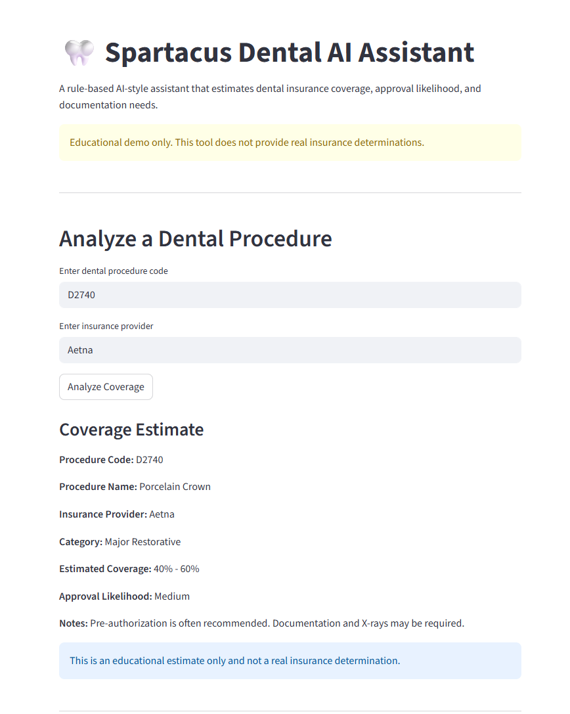
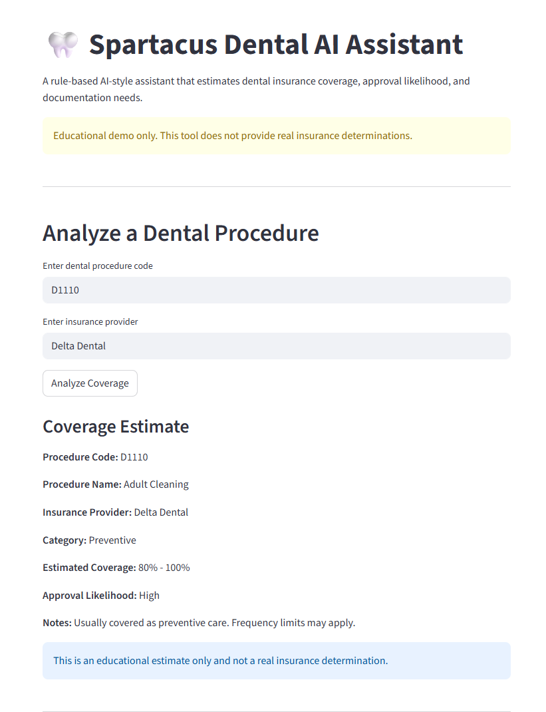
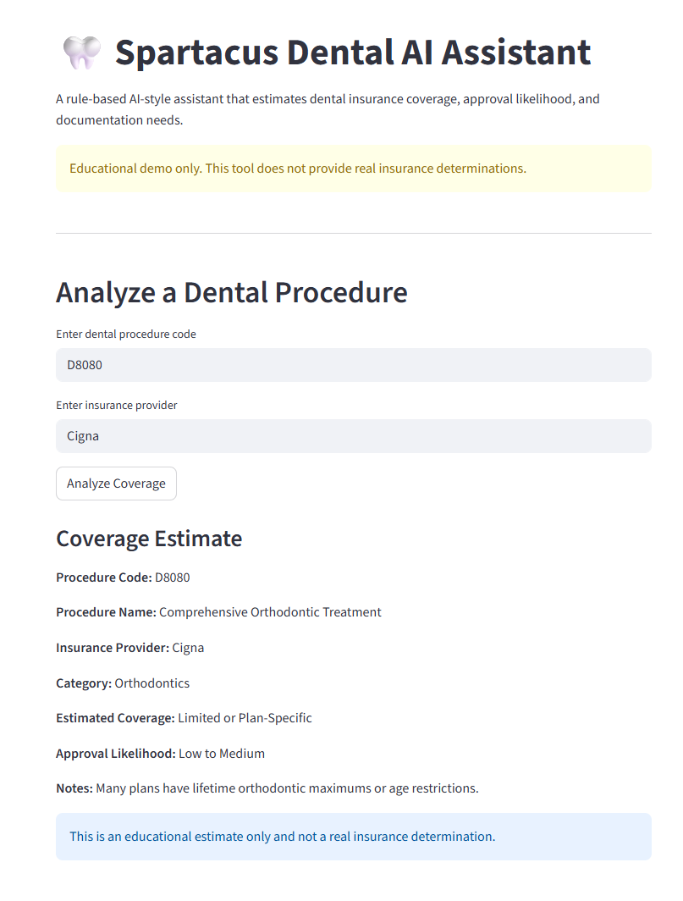
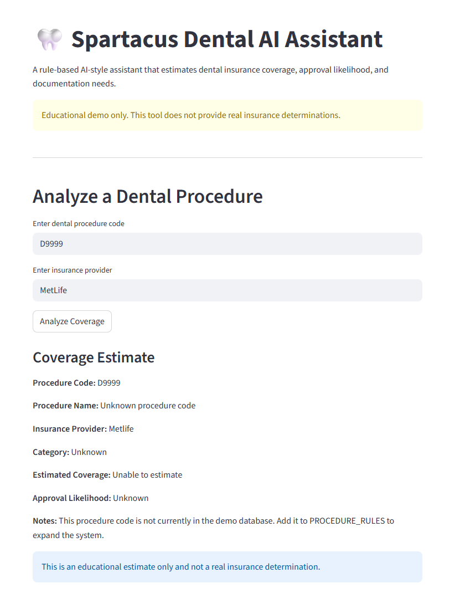

# 🦷 Spartacus: Dental Insurance AI Assistant

## Overview
Spartacus is an AI-powered assistant designed to help dental clinics and patients quickly understand insurance coverage, treatment approvals, and estimated out-of-pocket costs.

The system simulates real-world insurance decision support by combining structured insurance data with AI-generated insights, reducing the time spent manually reviewing policies and documentation.

---

## 🎥 Demo

---

## Problem Statement
Dental clinics often spend significant time manually verifying insurance coverage and determining patient financial responsibility. This process can delay treatment decisions and create inefficiencies for both clinics and patients. 

The process includes diving into:

- Coverage percentages
- Patient cost responsibility
- Pre-authorization requirements
- Claim approval likelihood

This process is time-consuming, error-prone, and can lead to unexpected costs for patients or delayed payments for clinics.

---

## Solution
Spartacus provides a simple interface where users input:

- Dental procedure code (e.g., D1110, D2740)
- Insurance provider

The system then generates:

- Estimated coverage percentage
- Patient out-of-pocket cost insight
- Approval likelihood
- Required documentation notes

---

## Key Features

- 🧠 AI-Powered Decision Support  
  Uses a language model to generate realistic insurance insights based on user input

- 📊 Structured + AI Hybrid Logic  
  Combines predefined insurance data with AI reasoning for more grounded results

- ⚡ Fast Lookup Simulation  
  Eliminates manual searching through insurance documents

- 🖥️ Streamlit Interface  
  Simple and interactive UI for real-time use

---

## Tech Stack

- Python
- Streamlit
- OpenAI API (or local LLM alternative)
- JSON / Dictionary-based data layer
- Rule-based logic system
- Prompt engineering concepts

---

## How It Works

1. User enters a dental procedure code and insurance provider  
2. Spartacus processes the input using structured logic  
3. The system estimates:
   - Coverage percentage
   - Approval likelihood
   - Patient financial responsibility
4. Results are displayed through an interactive Streamlit interface

---

## Example Output

**Input:**
- Procedure: D2740 (Crown)  
- Insurance: Aetna  

**Output:**
- Coverage: ~50%  
- Patient Cost: Moderate to High  
- Approval Likelihood: Medium  
- Notes: Pre-authorization recommended  

---

## How to Run

### Option 1: Local (Recommended)

1. Clone the repository:
git clone https://github.com/samirag2010/spartacus-dental-ai.git  
cd spartacus-dental-ai  

2. Install dependencies:
pip install -r requirements.txt  

3. Run the app:
streamlit run app.py  

---

## Future Improvements

- Real insurance API integration  
- RAG system for reading insurance policy documents  
- Patient-facing dashboard  
- Multi-user clinic system  
- Database integration (SQLite or PostgreSQL)  

---

## What I Learned

- Designing AI-assisted decision systems  
- Prompt engineering for structured outputs  
- Combining rule-based logic with generative AI  
- Building interactive AI applications using Streamlit  

---

## Portfolio Context

Developed as part of my Applied AI & Robotics studies at Houston City College, with a focus on practical healthcare AI and workflow automation systems.

---

## Contact

- GitHub: https://github.com/samirag2010  
- LinkedIn: (add your link)  
- Email: samirad2012@hotmail.com 

---

## Disclaimer

This project is for educational and demonstration purposes only. It does not provide real insurance determinations and should not be used for clinical or financial decisions.
